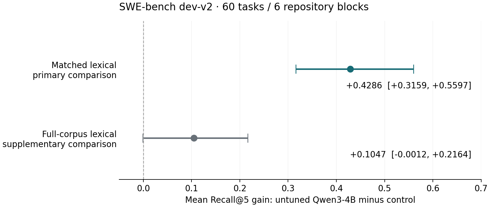

# Untuned small-model file localization with bounded evidence

Technical report · 2026-10-06 · Efficient Agentic Inference, Track 1

## Abstract

We compare an untuned Qwen3-4B-Instruct-2507 Q4_K_M model with lexical file
ranking on 60 frozen SWE-bench development tasks from six repositories. With
identical bounded candidate paths and excerpts, mean Recall@5 is 0.6569 for the
model and 0.2283 for lexical ranking. The paired gain is 0.4286; its repository-block
bootstrap 95% interval is [0.3159, 0.5597]. All attempts are retained, including
eight invalid model answers scored as failures. The finding supports further
development comparisons under this evidence contract. It does not establish
generalization, specialization, replacement of a larger generalist or economic
benefit. Independent repetition of the GPU campaign has not been performed.

## Question and experimental design

Does an untuned small language model improve file localization over lexical
ranking when both receive the same bounded evidence? This tests the value of
the model treatment, without training, retries, output repair or fallback.

The [frozen dev-v2 population](../../splits/dev-v2.json) contains 60 new tasks
from the pinned SWE-bench development source, excluding the earlier 12-task
pilot and normalized same-repository issue equivalents. All Verified instances
remain reserved. Selection uses repository round-robin and seeded SHA-256
ordering without patches, labels or model performance. Six known repositories
make this a development population, not a representative or held-out benchmark.

Repository files come from each issue's base commit. Gold file paths are derived
from the solution patch by the separate evaluator under
[localization-v2](../benchmark-localization-v2.md). Gold, test metadata, evaluator,
Git history and full repositories are absent from the inference namespace.
Runtime isolation does not address model pretraining contamination.

The `bm25-top20-prefix1200-v1` packet contains the full issue and at most 20
BM25-selected paths with the first 1,200 Unicode characters of each file. Paths
are sorted lexicographically; retrieval scores and ranks are omitted. The model
and matched lexical control share exact candidate lists and excerpt hashes.
Full-corpus lexical is a separate reference with access to more paths and text.

The [preregistered protocol](../experiments/untuned-dev-v2.md) fixes K=5,
one attempt per task, the prompt and execution settings. Qwen uses its native
chat template, greedy decoding, a 16,384-token context and 512-token output budget
on one NVIDIA L4 through pinned llama.cpp. Evaluation happens after prediction.

## Quality and uncertainty

| Treatment | Mean Recall@5 | Strict Success@5 | Candidate ceiling |
| --- | ---: | ---: | ---: |
| Lexical, full corpus | 0.5523 | 25/60 | 0.9854 |
| Lexical, matched packet | 0.2283 | 8/60 | 0.7835 |
| Untuned Qwen3-4B Q4_K_M, matched packet | 0.6569 | 33/60 | 0.7835 |

Recall is macro-averaged file-set coverage. Strict success means all reference
files appear in the top five; it does not mean an issue was repaired. Candidate
ceiling measures accessible gold files and is independent of ranking.



*Points are model-minus-control gains; lines are paired repository-block 95%
bootstrap intervals. Both comparisons retain all 60 tasks. The full-corpus
interval is supplementary and was computed after the run.*

The primary comparison passes the frozen development rule: Recall@5 gain at
least 0.05, noninferior strict success and a positive interval lower bound.
The interval uses 5,000 paired repository-block resamples, seed 20261006 and
nearest-rank percentiles. Six blocks limit the strength of population inference.

The full-corpus reference gain is 0.1047, with a supplementary interval
[-0.0012, 0.2164] that includes zero. Its point comparison was planned; the interval
is a post-run exploratory analysis with no acceptance rule. Different candidate
sets and source representations also prevent a pure ranker comparison.

The matched ceiling of 0.7835, compared with 0.9854 for the full corpus, reveals
loss from context selection. File presence does not establish excerpt sufficiency.
The positive matched comparison cannot by itself attribute the gain to reasoning.

## Invalid answers and repository variation

All 60 requests completed; 52 answers were valid. Every invalid answer contains
at least one path outside its permitted candidate list. The entire answer scores
zero rather than keeping its valid subset. There were no timeouts, overflows,
truncated inputs or output-budget exhaustion. No answer was repaired or retried.

| Repository | Tasks | Invalid answers | Model Recall@5 | Matched lexical Recall@5 |
| --- | ---: | ---: | ---: | ---: |
| marshmallow | 7 | 0 | 1.0000 | 0.2143 |
| pvlib | 11 | 2 | 0.6818 | 0.4091 |
| pydicom | 11 | 0 | 0.9242 | 0.5303 |
| astroid | 11 | 1 | 0.6222 | 0.0737 |
| pyvista | 10 | 0 | 0.5106 | 0.0976 |
| sqlfluff | 10 | 5 | 0.2798 | 0.0079 |

Five invalid answers are in sqlfluff, which also has the lowest packet ceiling
(0.4768). These observations identify format adherence and evidence coverage as
future questions; they do not establish the causes of individual failures.
Any intervention needs a new treatment and separate declared validation population.

## Resources and accounting

Request wall latency is 3.205 seconds at p50 and 4.215 seconds at p95; all 60
attempts are included. Total request wall time is 196.445 seconds, model load is
2.009 seconds and backend lifetime is 199.127 seconds. Native counters record
477,333 input and 2,190 generated tokens, including invalid answers and EOS.
All 37 model layers are confirmed offloaded to GPU.

Request latency includes rendering, tokenization, prefill, decoding and validation.
It excludes acquisition, context building, model verification/load, evaluation
and transfer. Lexical timings use a different CPU and scope; no matched deployment
speedup is claimed. Active GPU-seconds and per-task server CPU remain unknown.

The cloud session, including setup, failed starts, probes and collection, lasted
46.19 minutes to confirmed VM/disk absence. Its compute-only list-rate scenario
is USD 0.5441, excluding other charges and account adjustments. This is not an
invoice or measured total system cost. Monetary cost and cost per successful
localization remain null; these numbers do not establish agent economics.

## Evidence, reproduction and next comparison

The [immutable experiment bundle](../../results/reports/untuned-dev-v2-l4/README.md)
contains predictions, per-task metrics, exact revisions/configs, bootstrap analyses,
failure records, resource evidence and checksums. Inference code is clean
`f67e4993aa93c5c05e13e28b0bb4b0bf0ea8dc53`; documentation and release revisions
are separate identities. Original artifact bytes are preserved.

Two GPU technical starts failed before generation; both are recorded. An earlier
CPU smoke was incomplete and is reported separately, not pooled with dev-v2.
Synthetic CPU/GPU parity checks establish API behavior only. CPU CI and checksum
verification do not constitute independent repetition of model predictions.

Use the [reproduction guide](../reproducibility.md) and
[CUDA procedure](../experiments/cuda-execution.md) to reconstruct inputs and the
execution environment. Source-bearing traces remain in the ignored private archive;
its checksum is public. A fresh paid GPU repetition requires its own authorization.

The figure reads the two saved comparison JSON files. With Python and
Matplotlib 3.10.7, run from the repository root:

```bash
python docs/technical-reports/plot-untuned-dev-v2.py
```

The next research comparison is a stronger generalist on the same semantic
evidence with explicit system cost accounting. This untuned result alone does
not justify training. Verified, repository/time generalization, downstream repair,
fallback and training-amortized economics remain untested.
